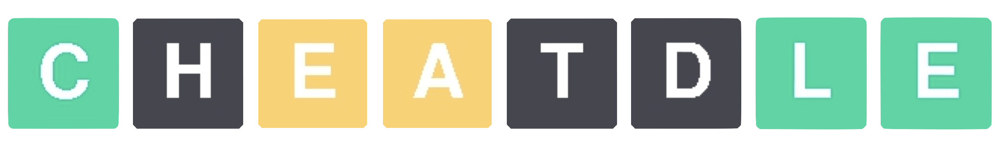
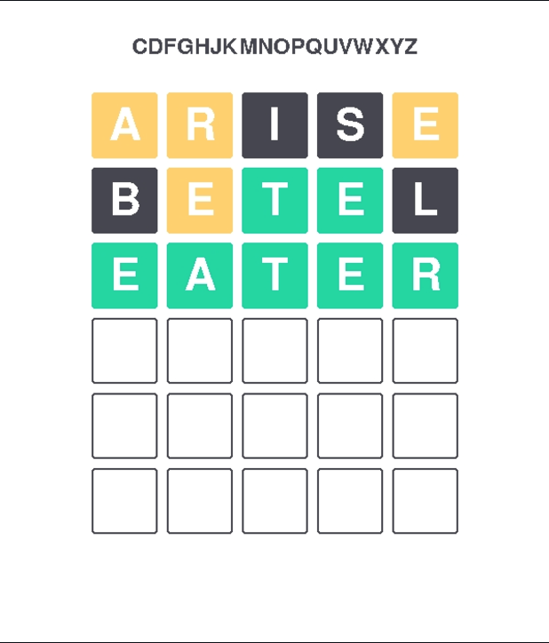

<a id="readme-top"></a>

<!-- PROJECT SHIELDS -->
<!--
*** See the bottom of this document for the declaration of the reference variables
-->
[![Contributors][contributors-shield]][contributors-url]
[![Forks][forks-shield]][forks-url]
[![Stargazers][stars-shield]][stars-url]
[![Issues][issues-shield]][issues-url]


<!-- PROJECT LOGO -->
<br />
<div align="center">
  <a href="https://github.com/ahmadbasyouni10/Cheatdle">
    
  </a>
  <h1 align="center">Cheatdle</h1>
  <p align="center">
    <br />
    <a href="https://github.com/ahmadbasyouni10/Cheatdle"><strong>Explore »</strong></a>
    <br />
    <br />
    <a href="https://cheatdle.streamlit.app/">View Project Site</a>
    ·
    <a href="https://cheatdle-rag.streamlit.app/">View Project RAG</a>
    ·
    <a href="https://github.com/ahmadbasyouni10/Cheatdle/issues">Report Bug</a>
    ·
    <a href="https://github.com/ahmadbasyouni10/Cheatdle/pulls">Request Feature</a>
  </p>
</div>


<!-- TABLE OF CONTENTS -->
<details>
  <summary>Table of Contents</summary>
  <ol>
    <li>
      <a href="#about-the-project">About The Project</a>
      <ul>
        <li><a href="#built-with">Built With</a></li>
      </ul>
    </li>
    <li>
      <a href="#getting-started">Getting Started</a>
      <ul>
        <li><a href="#prerequisites">Prerequisites</a></li>
        <li><a href="#installation">Installation</a></li>
      </ul>
    </li>
    <li><a href="#usage">Usage</a></li>
    <li><a href="#contributing">Contributing</a></li>
    <!-- <li><a href="#license">License</a></li> -->
    <li><a href="#contact">Contact</a></li>
    <li><a href="#acknowledgments">Acknowledgments</a></li>
  </ol>
</details>


<!-- ABOUT THE PROJECT -->
## About The Project

  <br/> <div align="center">
    <a href="">
      
    </a>
  </div> <br/>

Cheatdle is an application to maximize efficiency when playing Wordle, using information theory and machine learning. 

Originally an adaptation of 3Blue1Brown's video, _[Solving Wordle using information theory](https://www.youtube.com/watch?v=v68zYyaEmEA)_, it also allows users to predict how difficult any possible Wordle answer, and determine the public sentiment of some past Wordle answers using tweet data. Users can also view graphs of Wordle facts and statistics from all over the world.

You can learn more about this project by referring to the project design document, or by asking the project RAG!

### Built With
[![Python][Python]][Python-url]
[![Numpy][Numpy]][Numpy-url]
[![Pandas][Pandas]][Pandas-url]
[![SciPy][Scipy]][Scipy-url]
[![Scikit-Learn][Scikit-Learn]][Scikit-url]
[![Plotly][Plotly]][Plotly-url]
[![OpenAI][OpenAI]][OpenAI-url]
[![Streamlit][Streamlit]][Streamlit-url]
[![Pygame][Pygame]][Pygame-url]

<p align="right">(<a href="#readme-top">back to top</a>)</p>


<!-- GETTING STARTED -->
## Getting Started

See the below instructions to run the project locally.

### Prerequisites

You must have Python 3 and pip installed. 

You can verify that you have Python installed by running the following command in your terminal:
```sh
python --version
```
While pip is automatically installed with the [official release](https://www.python.org/downloads/https://www.python.org/downloads/) of Python from their website, you can install pip by running the following command in your terminal, if you do not have it:
```sh
python -m ensurepip --upgrade
```


### Installation

1. Clone the repo
   ```sh
   git clone https://github.com/ahmadbasyouni10/Cheatdle.git
   ```
2. Install PIP packages
   ```sh
   pip install -r requirements.txt
   ```
3. Run the application using Streamlit
   ```sh
   streamlit run app.py
   ```
4. To use the project RAG, you must acquire an [OpenAI API key.](https://openai.com/index/openai-api/)
5. In the project's root directory, create a `.env` file with the following contents:
   ```
   OPENAI_API_KEY=sk-your_api_key_here
   ```
**NOTE:** This repository contains a different implementation of Cheatdle without Pygame or the RAG included, due to memory limitations on Streamlit Community Cloud.
If you would like to use a version that contains all features and a Pygame implementation of Wordle in one app, refer to the fork `luna-cheatdle`.

<p align="right">(<a href="#readme-top">back to top</a>)</p>


<!-- USAGE EXAMPLES -->
## Usage

### Wordle Solver
1. Enter your valid five-letter Wordle guess into the input prompt.
2. The game boxes with the guess information, the right entropy table, and the below list of candidate answers will update.
3. Repeat until the game is won or lost, and restart with a new word, if desired.


### Wordle Score Predictor
1. Enter your five-letter Wordle guess into the input prompt.
2. The model will predict the average score it will take for the general public to guess.
3. You can view guess statistics, and the app will compare it with the generated inference.


### Wordle Answer Sentiment Analysis
1. Enter your valid five-letter Wordle guess into the input prompt.
2. If the word you entered is in the tweet dataset, it will use tweets with that word to generate sentiment analysis.
3. You can also view the sentiment analysis as the average in chart form, or as a breakdown of all sentiments.


### Cheatdle Project RAG
1. Enter any prompt related to the Cheatdle project.
2. The RAG will scan the design document and create a response.
3. That response will be added to the text log, which will update and be displayed to the user.


<p align="right">(<a href="#readme-top">back to top</a>)</p>


<!-- CONTACT -->
## Contact

| Name           | LinkedIn                                      | GitHub                             |
|----------------|-----------------------------------------------|------------------------------------|
| Ahmad Basyouni | www.linkedin.com/in/ahmad-basyouni-b5a049236/ | https://github.com/ahmadbasyouni10 |
| Alysa Vega     | www.linkedin.com/in/alysavega/                | https://github.com/alyliann        |
| Miguel Luna    | www.linkedin.com/in/miguel-lorenzo-luna       | https://github.com/luna-miguel     |


<!-- ACKNOWLEDGMENTS -->
## Acknowledgments

The following sources were referenced and/or used for this project:
* [3Blue1Brown's video](https://youtu.be/v68zYyaEmEA?si=dPYxpEGF7xUUBD1e)
* [3Blue1Brown's code](https://github.com/3b1b/videos/tree/master/_2022/wordle)
* [Wordle Tweets](https://www.kaggle.com/datasets/benhamner/wordle-tweets)
* [Letter frequencies](https://gist.github.com/CliffordAnderson/b9b204a6d55b06bedd511326afd3e8b9)
* [Wordle statistics, facts, & strategies (based on 530 Million Wordles) - Photutorial](https://photutorial.com/wordle-statistics/#:~:text=On%20average%2C%20Wordle%20players%20can,the%20theoretical%20best%20(0.043%25))

Special thanks to:
* [CUNY Tech Prep](https://cunytechprep.org/)
* [Zack DeSario](https://www.linkedin.com/in/zackd/)

<p align="right">(<a href="#readme-top">back to top</a>)</p>


<!-- MARKDOWN LINKS & IMAGES -->
<!-- https://www.markdownguide.org/basic-syntax/#reference-style-links -->
[contributors-shield]: https://img.shields.io/github/contributors/ahmadbasyouni10/cheatdle.svg?style=for-the-badge
[contributors-url]: https://github.com/ahmadbasyouni10/cheatdle/graphs/contributors
[forks-shield]: https://img.shields.io/github/forks/ahmadbasyouni10/cheatdle.svg?style=for-the-badge
[forks-url]: https://github.com/ahmadbasyouni10/cheatdle/forks
[stars-shield]: https://img.shields.io/github/stars/ahmadbasyouni10/cheatdle.svg?style=for-the-badge
[stars-url]: https://github.com/ahmadbasyouni10/cheatdle/stargazers
[issues-shield]: https://img.shields.io/github/issues/ahmadbasyouni10/cheatdle.svg?style=for-the-badge
[issues-url]: https://github.com/ahmadbasyouni10/cheatdle/issues
[license-shield]: https://img.shields.io/github/license/ahmadbasyouni10/cheatdle.svg?style=for-the-badge
[license-url]: https://github.com/github_username/repo_name/blob/master/LICENSE.txt
[linkedin-shield]: https://img.shields.io/badge/-LinkedIn-black.svg?style=for-the-badge&logo=linkedin&colorB=555
[linkedin-url]: https://linkedin.com/in/linkedin_username
[product-screenshot]: captures/example.png
[Python]: https://img.shields.io/badge/python-FFDE57?style=for-the-badge&logo=python&logoColor=4584B6
[Python-url]: https://www.python.org/
[Numpy]: https://img.shields.io/badge/numpy-%23013243.svg?style=for-the-badge&logo=numpy&logoColor=white
[Numpy-url]: https://numpy.org/
[OpenAI]: https://img.shields.io/badge/openai-000000?style=for-the-badge&logo=openai&logoColor=fffff
[OpenAI-url]: https://openai.com/
[Streamlit]: https://img.shields.io/badge/streamlit-ffffff?style=for-the-badge&logo=streamlit&logoColor=ff0000
[Streamlit-url]: https://streamlit.io/
[Pandas-url]: https://pandas.pydata.org/
[Pandas]:https://img.shields.io/badge/pandas-%23150458.svg?style=for-the-badge&logo=pandas&logoColor=white
[Scipy-url]: https://scipy.org/
[Scipy]:https://img.shields.io/badge/SciPy-%230C55A5.svg?style=for-the-badge&logo=scipy&logoColor=%white
[Scikit-url]:https://scikit-learn.org/stable/
[Scikit-Learn]:https://img.shields.io/badge/scikit--learn-%23F7931E.svg?style=for-the-badge&logo=scikit-learn&logoColor=white
[Plotly-url]:https://plotly.com/
[Plotly]:https://img.shields.io/badge/Plotly-%233F4F75.svg?style=for-the-badge&logo=plotly&logoColor=white
[Pygame-url]:https://www.pygame.org/news
[Pygame]:https://custom-icon-badges.demolab.com/badge/pygame-013243.svg?logo=pygame
